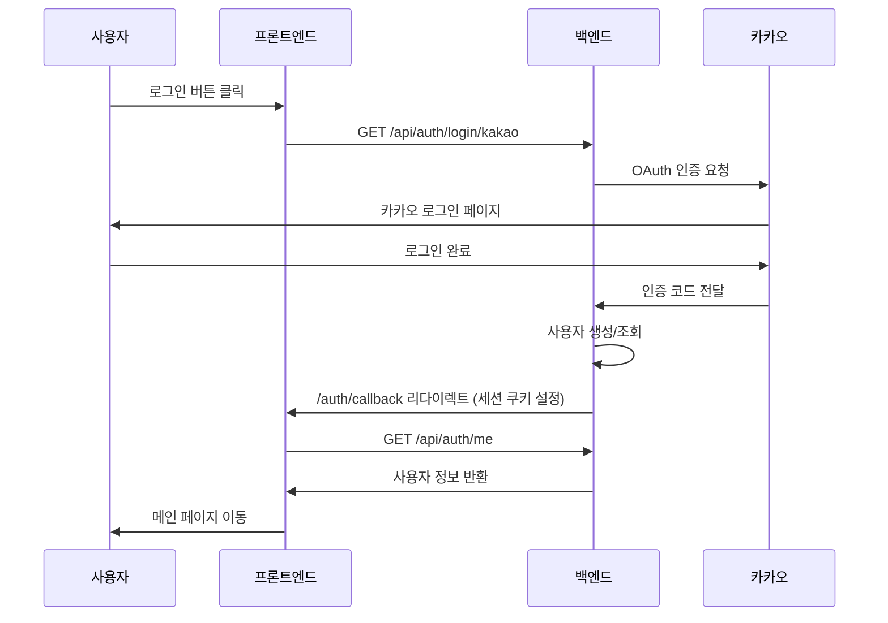

# OAuth 로그인 연동

## 개요

백엔드 OAuth2 인증과 프론트엔드 연동 구현 문서입니다.

```
사용자 → 로그인 버튼 → 백엔드 OAuth 리다이렉트 → 카카오 로그인 → 콜백 처리 → 메인 페이지
```

---

## 인증 플로우



---

## 구현 파일

| 파일 | 역할 |
|------|------|
| `src/context/AuthContext.tsx` | 인증 상태 관리, API 호출 |
| `src/pages/Login.tsx` | 로그인 UI, 소셜 로그인 버튼 |
| `src/pages/AuthCallback.tsx` | OAuth 콜백 처리 |
| `src/App.tsx` | 라우트 설정 (`/auth/callback`) |

---

## AuthContext 주요 함수

### socialLogin

백엔드 OAuth 엔드포인트로 리다이렉트합니다.

```tsx
const socialLogin = (provider: "google" | "kakao"): void => {
  if (provider === "kakao") {
    window.location.href = `${API_BASE_URL}/api/auth/login/kakao`;
  }
  // Google은 미구현
};
```

### fetchUser

세션 쿠키를 이용해 현재 사용자 정보를 조회합니다.

```tsx
const fetchUser = useCallback(async (): Promise<boolean> => {
  try {
    const response = await fetch(`${API_BASE_URL}/api/auth/me`, {
      credentials: "include", // 쿠키 포함 필수
    });
    if (!response.ok) return false;

    const data = await response.json();
    if (data.success && data.data) {
      setUser({
        id: String(data.data.userId),
        email: data.data.email,
        name: data.data.name,
        profileImageUrl: data.data.profileImageUrl,
        // ...
      });
      return true;
    }
    return false;
  } catch {
    return false;
  }
}, []);
```

### logout

백엔드 로그아웃 API를 호출하고 로컬 상태를 초기화합니다.

```tsx
const logout = async () => {
  try {
    await fetch(`${API_BASE_URL}/api/auth/logout`, {
      method: "POST",
      credentials: "include",
    });
  } finally {
    setUser(null);
  }
};
```

---

## AuthCallback 컴포넌트

OAuth 성공 후 리다이렉트되는 콜백 페이지입니다.

```tsx
export default function AuthCallback() {
  const navigate = useNavigate();
  const { fetchUser } = useAuth();

  useEffect(() => {
    const handleCallback = async () => {
      const success = await fetchUser();
      if (success) {
        navigate("/", { replace: true });
      } else {
        navigate("/login?error=fetch_failed", { replace: true });
      }
    };
    handleCallback();
  }, [fetchUser, navigate]);

  return <div>로그인 처리 중...</div>;
}
```

---

## 설정

### 환경 변수

```
# .env (또는 직접 설정)
API_BASE_URL=http://localhost:8080
```

### CORS

백엔드에서 프론트엔드 origin을 허용해야 합니다.

```
# 백엔드 환경 변수
CORS_ALLOWED_ORIGINS=http://localhost:5173
```

---

## API 명세

| Method | Endpoint | 설명 | 인증 |
|--------|----------|------|:----:|
| GET | `/api/auth/login/kakao` | 카카오 로그인 시작 | X |
| GET | `/api/auth/me` | 현재 사용자 조회 | O |
| POST | `/api/auth/logout` | 로그아웃 | O |

### /api/auth/me 응답

```json
{
  "success": true,
  "data": {
    "userId": 1,
    "email": "user@example.com",
    "name": "사용자",
    "profileImageUrl": "https://..."
  }
}
```

---

## 체크리스트

| 항목 | 상태 |
|------|:----:|
| AuthContext API 연동 | ✅ |
| AuthCallback 컴포넌트 | ✅ |
| Login 페이지 수정 | ✅ |
| 라우트 설정 | ✅ |
| 쿠키 기반 인증 | ✅ |
